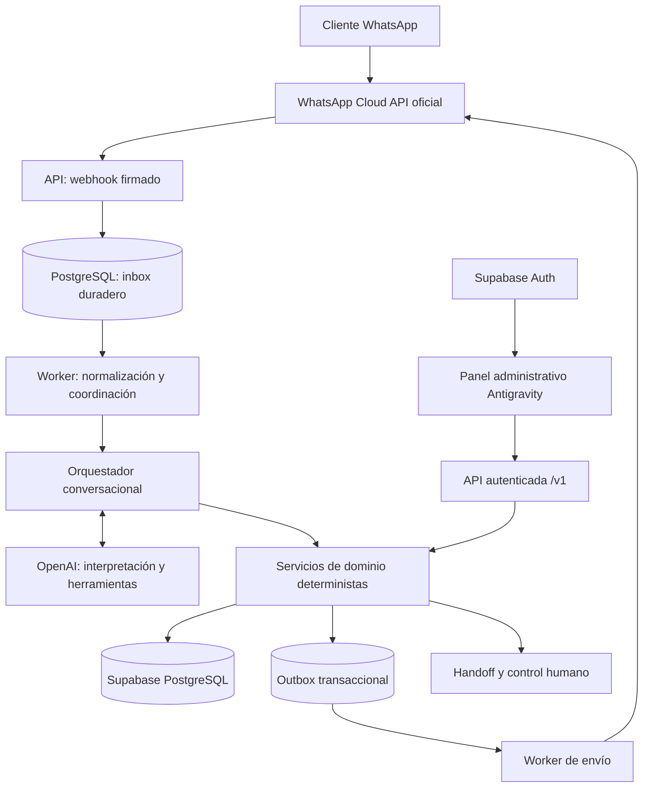

# Arquitectura del sistema — propuesta v0.1

Estado: diseño de fase 1; ningún componente descrito está implementado. Leer [inspección inicial](initial-assessment.md), [datos](data-model.md), [contratos](../api/contracts.md) y [decisiones](decisions.md).

## Componentes y límites



Elegimos un monolito modular Node.js/TypeScript con dos procesos desplegables (API y worker), un repositorio y PostgreSQL como inbox/outbox inicial. Reduce infraestructura y permite atomicidad con pedidos; no requiere Redis en el MVP. El adaptador de cola puede cambiar sin modificar el dominio. Supabase proporciona PostgreSQL y Auth; el panel consume la API para datos del negocio, sin acceso directo privilegiado a tablas. OpenAI solo propone llamadas y texto.

## Recorrido de un mensaje

1. Webhook valida firma sobre bytes originales, tamaño y estructura. El servidor resuelve negocio a partir de `metadata.phone_number_id` registrado, nunca de campos enviados por un usuario.
2. En una transacción inserta cada evento lógico en `webhook_events`. Responde 200 solo después del commit duradero; no espera a IA. Si DB falla responde 503 para que Meta reintente.
3. Worker reclama filas con lease y `FOR UPDATE SKIP LOCKED`; normaliza todos los mensajes y estados de todos los entries/changes. Aplica deduplicación antes de efectos.
4. Resuelve identidad del cliente por negocio y canal, mantiene conversación activa, persiste mensaje. Serializa efectos por conversación; el orden de recepción no garantiza orden causal de Meta.
5. Consulta estado de handoff y epoch de automatización. Si está pausada, registra y avisa al panel; no llama a IA ni responde automáticamente.
6. Construye contexto acotado. El orquestador ejecuta herramientas permitidas contra servicios: menú, carrito, dirección, tarifa y propuesta de pedido.
7. La confirmación requiere interacción explícita vinculada al pedido y su versión. Dominio revalida precios/disponibilidad/zona y crea snapshots. Cualquier cambio exige nueva propuesta y confirmación.
8. La transacción del dominio registra efecto, auditoría y outbox. La respuesta con cantidades/precios/estado usa plantilla del backend; el modelo solo aporta texto no autoritativo.
9. Worker comprueba ventana de mensajería, handoff/epoch y permisos de envío; llama a Meta. Persiste provider_message_id y procesa sent/delivered/read/failed sin retroceder estados.
10. Ante reclamo, petición humana o fallos repetidos, crea handoff, pausa automatización y genera evento para operadores.

## Organización propuesta (no carpetas funcionales actuales)

```text
apps/api/src/
  bootstrap/                 HTTP, worker, composición e inyección de dependencias
  config/                    Validación de variables; falla al arrancar si faltan
  modules/
    catalog/ customers/ conversations/ carts/ orders/ delivery/ handoffs/
      domain/                Entidades, invariantes y errores sin SDK/HTTP
      application/           Casos de uso, puertos y transacciones
      infrastructure/        Repositorios PostgreSQL
      http/                  Rutas, DTO, validación y autorización
  integrations/whatsapp/     Firma, normalización, envío y errores Meta
  integrations/openai/       Adapter Responses API, herramientas y presupuestos
  integrations/supabase/     Auth y conexiones PostgreSQL
  platform/                  Inbox/outbox, idempotencia, logs y observabilidad
packages/shared/             DTO públicos, enums y contrato API; sin secretos ni DB
```

Dependencias: HTTP → application → domain. Infrastructure implementa puertos; domain no importa SDK, framework ni DTO frontend. Controllers son adaptadores pequeños dentro del módulo. Evitamos carpetas globales de services/repositories que mezclan todos los dominios. Validación HTTP y resultados de herramientas en límites; invariantes nuevamente en dominio.

## Consistencia, infraestructura y escalado

- API sin memoria de sesión local; conexiones TLS con pool acotado, secrets separados por entorno, orígenes CORS explícitos.
- Worker con leases recuperables, heartbeat y límite de intentos. Nunca mantener transacción o lock PostgreSQL mientras se espera OpenAI/Meta. Reclamar operación, liberar, invocar proveedor, finalizar con CAS/version.
- Exclusión conversacional con lease + fencing token (`automation_epoch` y versión); toda mutación exige versión vigente. Pausar/iniciar handoff incrementa epoch e invalida trabajos antiguos.
- Outbox y eventos se crean dentro de la transacción del efecto. Publicación y transporte ofrecen al menos una vez; consumidores deduplican. No se promete exactamente una vez frente a proveedores externos.
- MVP: una instancia API y worker; múltiples negocios desde el esquema. Más workers reparten inbox por conversación/negocio, cuotas por negocio y backpressure. Separar servicios solo con evidencia de carga.
- Despliegue futuro en contenedores con health/liveness y readiness DB, apagado que termina leases, CI antes de promoción. Hosting/región aún abiertos. Backups/PITR según plan elegido y prueba de restauración antes de producción.
- Horarios en timezone IANA del negocio; fechas persistidas UTC. Moneda por negocio, importes enteros en unidad mínima; nunca float. País/moneda/impuestos se configuran con aprobación del negocio.

## MVP y exclusiones

Texto, botones/listas y ubicación recibida; menú, carrito, retiro/delivery por zonas configuradas, pedido y handoff. Pagos: solo `cash_on_delivery` registrado como pendiente, marcado manual por operador autorizado con auditoría; no cobros electrónicos ni credenciales financieras. No audio/OCR, campañas, GPS en vivo, inventario con reservas ni descuentos generativos. La disponibilidad es booleano de catálogo, revalidado al confirmar; reservas de stock son futura fase si el negocio las necesita.
