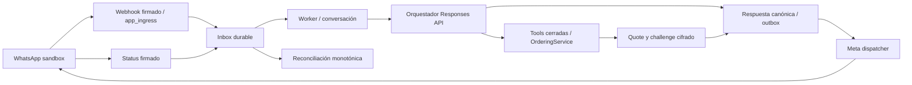

# Fase 5: runtime controlado de staging

Rama `codex/phase-05-staging-runtime-ai-meta`, Draft [PR #16](https://github.com/Derzam/Agente-IA/pull/16), base main `6915aa6cb45d85565856a38dd1f297235f4c26a2`. Implementación local con proveedores simulados. La activación externa requiere resolver los [blockers](activation-and-security.md). No hay merge ni hosting autorizado. Supabase permitido: exclusivamente `agente-ia-staging`, `pqffgbpbreuhivxxctvr`.

## Arquitectura

`modules/ai/` separa provider, instructions, registry/executor, loop, context, ports y persistence. `platform/runtime-safety.ts` contiene presupuesto, límites y circuito persistidos; `providers/meta/` contiene HTTP, dispatcher y cifrado. El orquestador no ejecuta SQL: consume puertos y llama servicios de aplicación de Fase 4. Los adapters PostgreSQL fijan tenant desde el worker/conversation mediante transacciones y RLS forzado.

`RuntimeWorker` procesa inbox/outbox interno y agenda hasta cuatro trabajos externos por instancia, uno por tenant, con recorrido circular. Las llamadas externas no retienen el polling ni una transacción de DB. El shutdown detiene claims, espera trabajos acotados y cierra pools. Los recibos internos continúan separados del envío WhatsApp.

## OpenAI y contexto

SDK oficial `openai@7.27.0`, exclusivamente `client.responses.create`. `OPENAI_MODEL` es obligatorio al habilitar IA; no hay modelo ni precios monetarios embebidos en dominio. `store:false`, sin `previous_response_id`, Conversations, Assistants, Threads/Runs ni Chat Completions. Se devuelve `reasoning.encrypted_content` únicamente a las siguientes Responses del mismo loop en memoria, usando el helper oficial del SDK; no se persiste respuesta cruda ni prompt.

`store:false` evita almacenamiento de application state para este flujo; **no garantiza Zero Data Retention ni elimina por sí solo los registros de prevención de abuso**. ZDR es una configuración separada del proveedor/cuenta que no se ha contratado ni verificado. Decisión basada en [controles de datos de OpenAI](https://developers.openai.com/api/docs/guides/your-data) y [estado stateless de Responses](https://developers.openai.com/api/docs/guides/conversation-state). No se afirma ninguna excepción de retención.

Contexto: mensaje actual (máximo 2000 caracteres, redacción de teléfonos, bearer/credenciales reconocibles y confirmation payload); únicamente la última respuesta canónica del bot de esa conversación (máximo 1800 caracteres). No se carga el historial de otros clientes ni mensajes anteriores del cliente con direcciones. Una ubicación actual conserva coordenadas porque son necesarias para delivery. Una dirección en la solicitud actual puede ser necesaria para `set_fulfillment`; no se devuelve al modelo desde snapshots/tools. La redacción por patrones no es un clasificador universal de secretos: no proporcionar credenciales por WhatsApp. Identidad completa del destinatario queda únicamente en el transport Meta.

El prompt trata texto del cliente y catálogo como datos no confiables. Para evitar que el modelo invente precios/productos/pagos en la salida, la prosa libre del modelo no se envía: se renderizan resultados comerciales canónicos de tools o una de cuatro frases de aclaración permitidas. Una cotización se encola atómicamente desde el servicio y no se duplica con prosa IA. Horarios/zonas no disponibles como respuesta de tool requieren handoff; no se añade herramienta abierta de settings.

## Tools y consentimiento

Whitelist exacta de nueve tools, schemas `strict:true` cerrados, todos los campos declarados requeridos (nullable cuando procede), Ajv valida nuevamente en backend. [Contrato oficial de function calling](https://developers.openai.com/api/docs/guides/function-calling). No hay SQL, HTTP libre, shell, filesystem, recipient libre, precio, impuestos ni estado de pago/pedido arbitrario.

| Tool | Servicio y límite |
| --- | --- |
| search_menu | Catálogo del tenant; búsqueda acotada |
| get_product | UUID y pertenencia verificados; producto/opciones canónicos |
| get_cart | Carrito actual del customer/conversation |
| add_to_cart | UUIDs, cantidades 1–99, selección de opciones validada; clave durable |
| remove_from_cart | UUID y expected_version; CAS y replay durable |
| set_fulfillment | pickup/delivery, dirección necesaria, expected_version; zona/reglas en dominio |
| request_quote | Recalcula precios/impuestos/zona/horario; quote/challenge/outbound atómicos |
| confirm_order | Solo el inbound interactivo actual fijado por backend; `{}` no permite elegir otro mensaje |
| request_human | Servicio de handoff real con enum cerrado de motivos |

El business/customer/conversation no procede de argumentos del modelo. Las mutaciones reutilizan idempotencia del dominio, con ID del tool execution como clave. Un slot aprobado persiste nombre/hash de argumentos en `runtime_plan`, append-only; su ejecución debe coincidir con el slot. El plan histórico de Fase 4 sigue inmutable. No se persisten los argumentos completos.

Antes de OpenAI, después de su respuesta, antes de cada tool y antes de outbound se comprueban status y `automation_epoch`. Cada mutación repite la comprobación bajo lock de conversación, junto con lease del turno. `human_pending`, `human_active` y `closed` bloquean automatización. Handoff durante una Response descarta su resultado. Un envío que ya cruzó la intención durable hacia HTTP puede estar en vuelo y no es revocable; no se promete retirar mensajes aceptados por Meta.

El inbound firmado normaliza el botón a evidencia hash antes de inbox. Business, channel/conversation, customer, challenge, order/version, TTL, hash y consumo previo se validan en Fase 4; luego se recalcula fingerprint de quote. Texto «sí», «ok» o «confirmo» no consiente. El worker confirma directamente mediante el servicio determinista, sin pedir al modelo que otorgue consentimiento, y encola un acuse deduplicado con pago pendiente. El transporte del challenge se describe en [seguridad](activation-and-security.md).

## Límites, fallos y persistencia

IA exige runtime flag AND settings.ai_enabled AND bot_active AND presupuesto AND circuito saludable. Cambiar `ai_enabled` nunca omite validación de configuración de arranque. Con flags vacíos ambos providers están deshabilitados.

Defaults configurables: 600 output tokens por Response, 8 tools por turno, 9 Responses de loop, timeout 15000 ms y un retry (máximo configurable dos), backoff 100/200 ms. SDK retries desactivados; cada intento verifica y reserva presupuesto local. Tiempo máximo de loop 90 segundos, sin empezar otra llamada si su timeout excede el plazo. No se repite una mutación ejecutada al reintentar Responses. Exceso, tool inválida, schema inválido, timeout/fallo o circuito abierto produce error operacional y handoff real si el epoch todavía es válido.

Por ventana fija compartida de 3600 segundos: conversación 100000 input tokens / 2000 output / 20 Responses / 50 tools; tenant 1000000 / 20000 / 200 / 500. Todos son configurables por entorno. Reserva conservadora antes de HTTP: dos veces bytes UTF-8 del input+schemas, más 2048; reserva máxima de output. Usage exitoso ajusta tokens a reales. Timeout/fallo/desconocido conserva reserva para no regalar capacidad; cada intento se contabiliza. Si usage excede reserva, se registra y detiene. Tokens de Responses fallidas no son observables como usage y sus reservas permanecen cargadas. No se hardcodea coste monetario.

Circuitos por tenant/provider en PostgreSQL: tres fallos abren 60 s; half-open permite una prueba con lease 45 s. Reiniciar/otra instancia conserva estado. No hay estado crítico solamente en memoria. Turno único activo por conversación, lease 120 s; un turno interrumpido se marca fallido y su mismo inbound no se ejecuta de nuevo. Esto evita repetir tools al recuperar un crash; la recuperación requiere revisión, no replay automático del turno. Un próximo inbound puede iniciar otro turno tras expirar el anterior. Duración por tool y timestamps del turno se registran.

| Límite por minuto | Alcance y almacenamiento |
| --- | --- |
| Webhook 300/IP, emergencia 10000/global | app_ingress; IP con HMAC, contador DB compartido |
| Inbound 30/customer y 600/tenant | DB app_worker; excedentes reintentan inbox acotadamente |
| API admin 120/actor/tenant | DB dentro de transacción autorizada; solicitudes fallidas revierten contador |
| HTTP admin 120/IP | Protección local adicional Fastify, incluye solicitudes inválidas; no sustituye cuota DB |
| Meta outbound 10/customer y 60/tenant | DB antes de claim/HTTP |
| IA | Cuotas de tokens/Responses/tools por tenant y conversación en ventana configurable |

Las ventanas DB requieren futura política de limpieza acotada; la migración no concede DELETE al runtime. Antes de producción definir retención y housekeeping administrativo. Los tenants comparten únicamente la protección de emergencia de ingress y capacidad física del proceso; sus presupuestos/circuitos/rate limits comerciales son independientes.

## Meta y estados ambiguos

Graph version por `META_GRAPH_API_VERSION`, origen HTTPS fijo `graph.facebook.com`, sin redirects, timeout configurado y respuesta limitada a 16 KiB. Env canonical META_*; WHATSAPP_* mantiene compatibilidad de ingreso. `META_WABA_ID` documentado pero no necesario para POST messages. `META_SANDBOX_RECIPIENTS` es una allowlist explícita obligatoria; nadie puede elegir recipient desde tool.

Solo mensajes libres dentro de 24h desde último inbound del cliente, canal activo y phone configurado. Bot exige los gates de automatización, mensaje humano exige human_active y epoch actual. Templates fuera de 24h no están implementados. Botón reply conforme al [contrato oficial Meta/Postman](https://www.postman.com/meta/whatsapp-business-platform/request/ne00kt6/send-reply-button). Callback `biz_opaque_callback_data` contiene únicamente el UUID de outbox; debe verificarse en sandbox de la versión Graph elegida antes de activar.

`pending → sending` persiste intención/fencing antes de HTTP. Únicamente aceptación válida WhatsApp + provider message ID produce `sent`; 429 con error Graph verificable permite backoff, máximo cinco intentos y dead_letter. 400/401/403/404 verificables son definitivos. Timeout, 5xx, respuesta malformada o caída después de intención durable son `unknown`. Recuperar sending expirado con intención lo convierte a unknown; **no se vuelve a enviar automáticamente**. La ventana entre intención y HTTP puede perder un envío tras crash: se prioriza evitar doble envío frente a garantía imposible de exactly-once externa sin idempotency del proveedor.

Status firmado/deduplicado encuentra mensaje por provider ID o callback de outbox, siempre dentro de business/channel correctos y con evidencia de intención. Actualiza outbox y message en lock order outbox→message. sent/delivered/read son monotónicos; failed tardío no degrada read/delivered. Callback permite resolver unknown cuando llega un estado verificado; SQL sigue prohibiendo unknown→pending/sending. Status desconocido/malformado o de otro canal se consume sin alterar datos. Si no llega callback/ID no existe API de consulta de resultado implementada: mantener unknown y revisar con evidencia del proveedor, sin endpoint de replay libre.

## Contratos, observabilidad y operación

Se conservan 49 operaciones públicas/runtime y schemas del panel. No se añade endpoint IA ni observabilidad sensible; no es necesario cambiar el contrato de Antigravity ni enviarle mensajes. HTTP logs contienen request_id, ruta declarada, status_code y latencia. Worker/IA logs contienen UUIDs, códigos, estados y contadores. No prompts, respuestas raw, argumentos, mensajes, teléfonos, direcciones, nonce ni tokens. `conversation_turns` registra provider/model/epoch/timestamps/tokens/Responses/tools/error; `tool_executions` nombre/secuencia/status/duración/hash y recurso permitido. Acceso técnico solo worker/RLS.

API `/health` y `/ready` verifican sus conexiones API e ingress; worker tiene `/health` y `/ready` en puerto separado (3001 por defecto), verifica conexión worker y shutdown. Readiness operativo requiere **ambos** procesos listos para cubrir las tres conexiones. Roles LOGIN sin superuser/BYPASSRLS/CREATEDB/CREATEROLE, exactamente una capability membership, sin ownership/DDL ni ACL directas en schema/tablas/columnas/functions. Configuración y secretos de features habilitadas se validan antes de escuchar. Los probes no prueban llamadas reales a OpenAI/Meta ni disponibilidad remota continua.

`Dockerfile.staging` proporciona dos comandos para la misma imagen Node 22: `api:start` y `worker:start`, usuario node. Se entrega configuración, sin ejecutar deploy ni crear infraestructura. Hosting futuro debe autorizar HTTPS, secret manager, restart policy, terminación TLS, red privada del probe worker y periodo de shutdown suficiente (al menos 120 s). Env config completa en [.env.example](../../.env.example), [validación](staging-validation.md) y [activación](activation-and-security.md).
